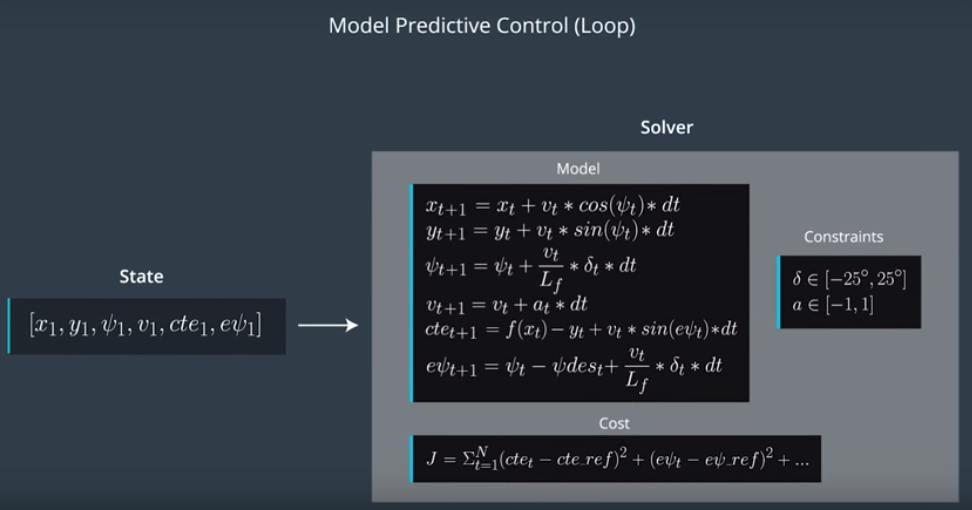

# CarND-Controls-MPC
Self-Driving Car Engineer Nanodegree Program

---
## Writeup


This is my best run on 3x speed. 100ms delay is enabled, max speed set to 100mph.

#### The model



On the picture you can see the MPC model (screened from Udacity lecture). We have the initial state vector, which consists of X, Y coordinates of the car, its orientation (psi), speed (v), cross track error (CTE) and orientation error (Epsi).

Then this vector, together with polynomial coefficients are fed into the solver, which considers car's constraints and its kinematic model, then optimises the cost function, finds the actuation commands (wheel angle — delta and acceleration) and predicts the future states.

I used bicycle model as a motion model of the car, because it is very simple and easy to calculate, though it provides decent approximation to the car behaviour. The only customisable parameter here is the Lf, which measures the distance between the front of the vehicle and its center of gravity.

#### Timestep Length and Elapsed Duration (N & dt)

I found the values, advised by the mentors on Q&A session to be the most stable and reliable. N = 10, dt = 0.1, thus we can predict 1 second in the future. dt = 0.1 is good because it equals our system delay of 100 milliseconds. And N = 10 is good balance between performance and prediction horizon, on high speeds (60-90 mph) it sometimes predicts further than the farthest waypoint.

#### Polynomial Fitting and MPC Preprocessing

The waypoints are converted from the beginning to the car's coordinate frame. I wrote a simple function "map2car()" in "helpers.h". It takes x, y and orientation of the car and x, y of a waypoint in global frame, and outputs waypoints x' and y' in car's frame. It does so by applying translation and then rotation around z axis, almost like we did in the "Kidnapped robot" project.

#### Model Predictive Control with Latency

I handled the 100ms latency by feeding the actuators' values from t-1 timestep to calculate the movement from time t to t+1. I did it in constraints setup routine in the FG_eval class (MPC.cpp lines 134-136).

Also I added two penalties to the cost function for overall smoothness and stability. On the line 82 of MPC.cpp I've added penalty (speed*steering)^2 for aggressive steering on high speeds, on the line 84 - penalty for rapid changes in CTE values. It made the car so much less wobbly. By fine tuning the weights of the components of the cost function I was able to run it with almost 100mph top speed!


## Dependencies

* cmake >= 3.5
 * All OSes: [click here for installation instructions](https://cmake.org/install/)
* make >= 4.1(mac, linux), 3.81(Windows)
  * Linux: make is installed by default on most Linux distros
  * Mac: [install Xcode command line tools to get make](https://developer.apple.com/xcode/features/)
  * Windows: [Click here for installation instructions](http://gnuwin32.sourceforge.net/packages/make.htm)
* gcc/g++ >= 5.4
  * Linux: gcc / g++ is installed by default on most Linux distros
  * Mac: same deal as make - [install Xcode command line tools]((https://developer.apple.com/xcode/features/)
  * Windows: recommend using [MinGW](http://www.mingw.org/)
* [uWebSockets](https://github.com/uWebSockets/uWebSockets)
  * Run either `install-mac.sh` or `install-ubuntu.sh`.
  * If you install from source, checkout to commit `e94b6e1`, i.e.
    ```
    git clone https://github.com/uWebSockets/uWebSockets
    cd uWebSockets
    git checkout e94b6e1
    ```
    Some function signatures have changed in v0.14.x. See [this PR](https://github.com/udacity/CarND-MPC-Project/pull/3) for more details.

* **Ipopt and CppAD:** Please refer to [this document](https://github.com/udacity/CarND-MPC-Project/blob/master/install_Ipopt_CppAD.md) for installation instructions.
* [Eigen](http://eigen.tuxfamily.org/index.php?title=Main_Page). This is already part of the repo so you shouldn't have to worry about it.
* Simulator. You can download these from the [releases tab](https://github.com/udacity/self-driving-car-sim/releases).
* Not a dependency but read the [DATA.md](./DATA.md) for a description of the data sent back from the simulator.


## Basic Build Instructions

1. Clone this repo.
2. Make a build directory: `mkdir build && cd build`
3. Compile: `cmake .. && make`
4. Run it: `./mpc`.

## Build with Docker-Compose
The docker-compose can run the project into a container
and exposes the port required by the simulator to run.

1. Clone this repo.
2. Build image: `docker-compose build`
3. Run Container: `docker-compose up`
4. On code changes repeat steps 2 and 3.

## Tips

1. The MPC is recommended to be tested on examples to see if implementation behaves as desired. One possible example
is the vehicle offset of a straight line (reference). If the MPC implementation is correct, it tracks the reference line after some timesteps(not too many).
2. The `lake_track_waypoints.csv` file has waypoints of the lake track. This could fit polynomials and points and see of how well your model tracks curve. NOTE: This file might be not completely in sync with the simulator so your solution should NOT depend on it.
3. For visualization this C++ [matplotlib wrapper](https://github.com/lava/matplotlib-cpp) could be helpful.)
4.  Tips for setting up your environment are available [here](https://classroom.udacity.com/nanodegrees/nd013/parts/40f38239-66b6-46ec-ae68-03afd8a601c8/modules/0949fca6-b379-42af-a919-ee50aa304e6a/lessons/f758c44c-5e40-4e01-93b5-1a82aa4e044f/concepts/23d376c7-0195-4276-bdf0-e02f1f3c665d)
5. **VM Latency:** Some students have reported differences in behavior using VM's ostensibly a result of latency.  Please let us know if issues arise as a result of a VM environment.

## Editor Settings

We have kept editor configuration files out of this repo to
keep it as simple and environment agnostic as possible. However, we recommend
using the following settings:

* indent using spaces
* set tab width to 2 spaces (keeps the matrices in source code aligned)

## Code Style

Please (do your best to) stick to [Google's C++ style guide](https://google.github.io/styleguide/cppguide.html).

## Project Instructions and Rubric

Note: regardless of the changes you make, your project must be buildable using
cmake and make!

More information is only accessible by people who are already enrolled in Term 2
of CarND. If you are enrolled, see [the project page](https://classroom.udacity.com/nanodegrees/nd013/parts/40f38239-66b6-46ec-ae68-03afd8a601c8/modules/f1820894-8322-4bb3-81aa-b26b3c6dcbaf/lessons/b1ff3be0-c904-438e-aad3-2b5379f0e0c3/concepts/1a2255a0-e23c-44cf-8d41-39b8a3c8264a)
for instructions and the project rubric.

## Hints!

* You don't have to follow this directory structure, but if you do, your work
  will span all of the .cpp files here. Keep an eye out for TODOs.

## Call for IDE Profiles Pull Requests

Help your fellow students!

We decided to create Makefiles with cmake to keep this project as platform
agnostic as possible. We omitted IDE profiles to ensure
students don't feel pressured to use one IDE or another.

However! I'd love to help people get up and running with their IDEs of choice.
If you've created a profile for an IDE you think other students would
appreciate, we'd love to have you add the requisite profile files and
instructions to ide_profiles/. For example if you wanted to add a VS Code
profile, you'd add:

* /ide_profiles/vscode/.vscode
* /ide_profiles/vscode/README.md

The README should explain what the profile does, how to take advantage of it,
and how to install it.

Frankly, I've never been involved in a project with multiple IDE profiles
before. I believe the best way to handle this would be to keep them out of the
repo root to avoid clutter. Most profiles will include
instructions to copy files to a new location to get picked up by the IDE, but
that's just a guess.

One last note here: regardless of the IDE used, every submitted project must
still be compilable with cmake and make./

## How to write a README
A well written README file can enhance your project and portfolio and develop your abilities to create professional README files by completing [this free course](https://www.udacity.com/course/writing-readmes--ud777).
